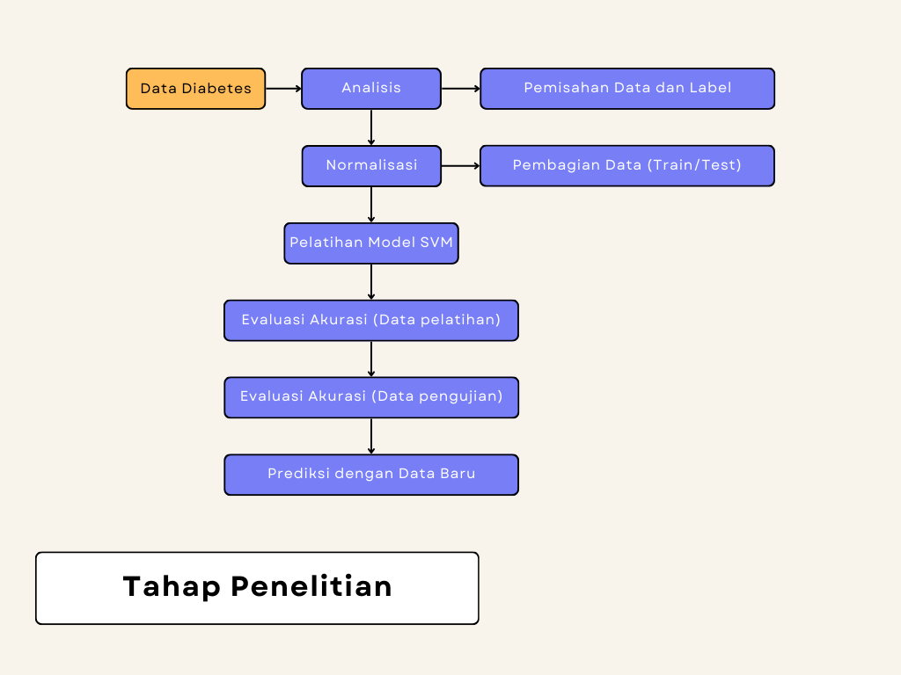

### JUDUL PENELITIAN

Prediksi Penyakit Diabetes Melitus Menggunakan Metode Support Vector Machine (SVM)

### LATAR BELAKANG

Diabetes Melitus (DM) merupakan penyakit metabolik kronis yang jumlah penderitanya semakin meningkat di seluruh dunia, termasuk di Indonesia[4]. Penyakit ini juga disebut sebagai _the silent killer_ karena merupakan jenis penyakit yang tidak menular tetapi menjadi salah satu penyakit yang mematikan[3]. Penyakit ini terkait erat dengan tingginya kadar glukosa dalam darah, yang dapat menyebabkan masalah kesehatan serius seperti gagal ginjal, penyakit jantung, dan masalah kesehatan lainnya. DM terus meningkat karena gaya hidup yang tidak sehat, pola makan yang tidak teratur, dan faktor genetik sehingga berdampak besar pada kesehatan masyarakat. Akibatnya, upaya preventif perlu dilakukan diperlukan untuk menemukan risiko DM secara dini.

Salah satu upaya preventif dalam mendeteksi penyakit DM ini adalah dengan melakukan pemeriksaan kadar gula darah[1]. Namun, penggunaan metode konvensional seperti pemeriksaan HbA1c tentu saja memiliki keterbatasan, karena tidak semua laboratorium di Indonesia memenuhi standar. Oleh karena itu, pengembangan model prediktif menggunakan metode Support Vector Machine (SVM), dapat menjadi solusi yang efektif. Metode SVM dikenal memiliki kemampuan untuk mengatasi masalah klasifikasi, termasuk dalam konteks prediksi DM. Selain itu, penggunaan teknik data mining, khususnya klasifikasi, telah menjadi tren dalam menganalisis data kesehatan. Dengan memanfaatkan data yang tersedia, penelitian ini bertujuan untuk membangun model prediktif yang dapat membantu dokter dalam mendeteksi potensi penderita Diabetes Melitus secara lebih cepat dan akurat. Melalui penelitian ini, diharapkan dapat membantu memberikan kontribusi yang signifikan dalam peningkatan pencegahan dan manajemen penyakit Diabetes Melitus di Indonesia.

### RUMUSAN MASALAH

Adapun rumusan masalah dalam penelitian ini, yaitu:

1. Bagaimana metode Support Vector Machine (SVM) dapat diterapkan dalam melakukan prediksi penyakit Diabetes Melitus?
2. Sejauh mana hasil akurasi menggunakan metode SVM akurat dalam memprediksi kemungkinan Diabetes Melitus?

### TUJUAN PENELITIAN

Adapun tujuan dari penelitian ini yaitu untuk mengembangkan model prediksi penyakit Diabetes Melitus (DM) menggunakan metode Support Vector Machine (SVM) dengan akurasi yang tinggi. Selain itu, tujuan penelitian ini juga mencakup :

1. Menerapkan dan menguji efektivitas metode SVM dalam memprediksi kemungkinan Diabetes Melitus.
2. Menilai performa model dalam hal sensitivitas, spesifisitas, dan akurasi secara keseluruhan.
3. Mengidentifikasi faktor-faktor yang paling berpengaruh dalam prediksi Diabetes Melitus menggunakan model SVM.

### MANFAAT PENELITIAN

Penelitian ini diharapkan dapat memberikan kontribusi yang signifikan pada bidang kesehatan serta teknologi informasi, dengan memberikan:

1. Alat yang membantu dalam melakukan prediksi identifikasi dini pada penyakit Diabetes Melitus
2. Meningkatkan pemahaman tentang faktor-faktor penyebab Diabetes Melitus melalui penelitian ini

### METODE PENELITIAN

Metode yang akan digunakan pada penelitian ini merupakan metode Support Vector Machine (SVM), metode ini akan membantu dalam melakukan prediksi terhadap diabetes melitus pada dataset yang diberikan. SVM sendiri merupakan salah satu algoritma machine learning yang digunakan untuk tugas klasifikasi dan regresi. Dalam penelitian ini, metode SVM digunakan untuk mengklasifikasikan apakah seseorang tersebut merupakan penderita diabetes atau tidak berdasarkan atribut kesehatan yang diberikan. Adapun tahapan yang perlu dilakukan dalam penelitian ini akan ditunjukkan pada gambar dibawah ini:

1. Pengumpulan Data Diabetes
   Penelitian ini menggunakan dataset diabetes yang diunduh dari Kaggle, berisi informasi kesehatan pasien seperti:

- Kehamilan: Untuk menyatakan jumlah kehamilan
- Glukosa: Untuk mengekspresikan tingkat Glukosa dalam darah
- Tekanan darah: Untuk menyatakan pengukuran tekanan darah
- Ketebalan Kulit: Untuk mengekspresikan ketebalan kulit
- Insulin: Untuk mengekspresikan tingkat Insulin dalam darah
- BMI: Untuk mengekspresikan indeks massa tubuh
- DiabetesPedigreeFunction: Untuk mengekspresikan persentase Diabetes
- Usia: Untuk mengekspresikan usia
- Hasil: Untuk menyatakan hasil akhir 1 adalah Ya dan 0 adalah Tidak

2. Pemisahan Data dan Label
   Pada tahap ini, data akan dibagi menjadi dua bagian yaitu data (X) dan label (Y). Data mencakup atribut kesehatan, sedangkan label mencerminkan apakah pasien menderita diabetes atau tidak.

3. Normalisasi Data dan Pembagian Dataset
   Data akan dinormalisasi untuk memastikan skalanya seragam di semua fitur. Setelah normalisasi, dataset dibagi menjadi dua subset: pelatihan dan pengujian. Pembagian ini penting untuk melatih model pada data yang berbeda dengan data yang diuji.

4. Pelatihan Model SVM (Kernel Linear)
   Model Support Vector Machine (SVM) dipilih dengan kernel linear untuk melatih data pelatihan karena metode SVM dianggap memiliki kemampuan untuk menangani klasifikasi dengan baik.

5. Evaluasi Akurasi pada Data Pelatihan
   Setelah pelatihan model SVM, dilakukan evaluasi pada data pelatihan untuk mengukur sejauh mana model dapat mempelajari pola dari data yang diberikan.

6. Evaluasi Akurasi pada Data Pengujian
   Model juga diuji pada dataset pengujian, Tujuannya agar memberikan gambaran seberapa baik model dapat men-generalisasi pengetahuannya ke data baru.

7. Prediksi dengan Data Baru
   Model dapat digunakan untuk membuat prediksi terhadap data baru yang tidak termasuk dalam dataset pengujian, hal ini dilakukan untuk menguji coba bagaiamana kemampuan metode SVM dalam melakukan prediksi penyakit diabetes melitus di dunia nyata.

### REFERENSI YANG DIGUNAKAN

[1] Candi Aldama and Muhammad Nasir, “KLASIFIKASI PENYAKIT DIABETES MENGGUNAKAN METODE SUPPORT VECTOR MACHINE PADA RUMAH SAKIT UMUM PRABUMULIH”, BETRIK, vol. 14, no. 02 AGUSTUS, pp. 376–383, Aug. 2023.
[2] F. Lufiana, "Klasifikasi Penderita Penyakit Diabetes Mellitus Menggunakan Metode Support Vector Machine," Skripsi, Fakultas Matematika dan Ilmu Pengetahuan Alam, Universitas Lampung, Bandar Lampung, 2021.
[3] Frisma Handayanna, “PENERAPAN METODE SUPPORT VECTOR MACHINE MENGGUNAKAN OPTIMASI GENETIC ALGORITHM UNTUK PREDIKSI PENYAKIT DIABETES”, JTI, vol. 1, no. 2, hlm. 139–147, Feb 2021.
[4] H. S. Wafa, A. I. Hadiana, dan F. R. Umbara, "Prediksi Penyakit Diabetes Menggunakan Algoritma Support Vector Machine (SVM)," Informatics and Digital Expert (INDEX), vol. 4, no. 1, hal. 40-45, Juli 2022.
[5] Lumbanraja, Favorisen R and Lufiana, Fanni and Heningtyas, Yunda and Muludi, Kurnia (2022) IMPLEMENTASI SUPPORT VECTOR MACHINE (SVM) UNTUK KLASIFIKASI PEDERITA DIABETES MELLITUS. Jurnal Komputasi, 10 (1). pp. 75-83.
